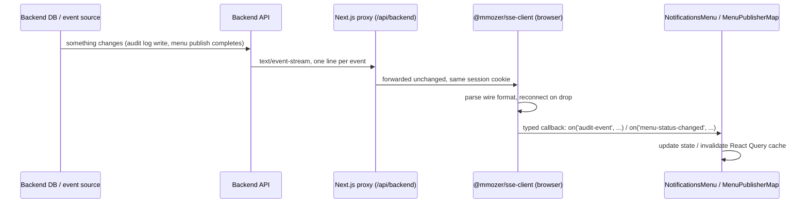
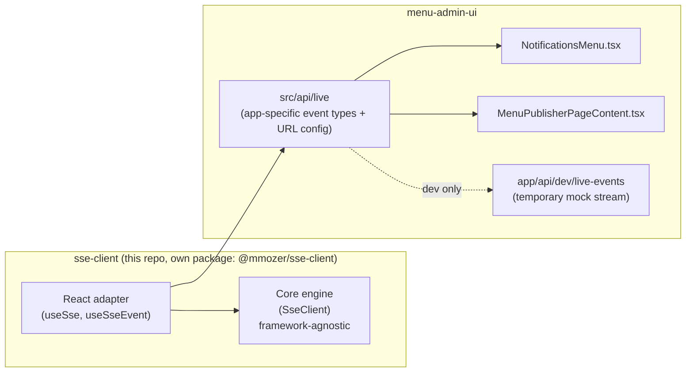

# Real-Time Updates System — Overview

**Audience:** software engineers and management
**Components:** `@mmozer/sse-client` (this repo) + its integration in `menu-admin-ui`
**Status:** client library and UI integration complete and tested; running against a local mock stream until a backend endpoint exists

---

## 1. Executive summary

Two features in the Menu Admin UI — the notifications bell and the menu-publisher map/dashboard — used to show stale data because they only refreshed on a page load or a manual re-fetch. There was no way to push new information (a new audit event, a menu that just finished publishing) to a user's screen as it happened.

This project adds a **real-time update system** based on Server-Sent Events (SSE): a one-way, push-based channel from the server to the browser. Instead of the UI repeatedly asking "anything new?" (polling), the server tells the UI the moment something changes.

**What was built:**

1. **`@mmozer/sse-client`** — a standalone, reusable client library (its own repo/npm package) that manages an SSE connection: opening it, parsing the wire format, reconnecting when it drops, and handing typed events to whoever is listening. It is not tied to this app — any team/product could use it.

**Why it matters (for management):**

- Users see changes (menu published, audit events) within seconds instead of after a manual refresh or the next poll cycle.
- Removes recurring polling requests to the backend, reducing load as usage grows.
- Built once, reusable everywhere: any future feature or future app that needs live updates can depend on the same package instead of re-solving this problem.
- No backend work was blocking this from shipping — the frontend is fully built and tested against a realistic mock server, ready to point at a real endpoint the moment the backend team implements it (see [§6](#6-current-status--whats-left)).

---

## 2. The problem, in plain terms

| Before | After |
| --- | --- |
| UI asks the server "anything new?" on a timer, or not at all | Server tells the UI the instant something changes |
| Notifications bell was a dead stub with no data source | Notifications bell fills in live as events happen |
| Menu-publisher map/dashboard only reflected data as of the last page load or a manual refetch | Map/dashboard silently refresh themselves when a location's status changes |
| Every team that wants "live updates" solves this from scratch | One well-tested, documented library the whole org can reuse |

### Why Server-Sent Events (SSE), not WebSockets?

The data only ever flows **one direction** — server to browser. The browser never needs to send data back over this channel (that's what regular REST calls are for). SSE is the simplest, most standard technology for exactly that shape of problem:

- It's plain HTTP — no new server infrastructure, ports, or protocols. Works through the same load balancers, proxies, and auth the app already uses.
- Browsers and reverse proxies handle it natively; no special library needed on either end.
- WebSockets are bidirectional and heavier-weight — the right tool when the browser also needs to send a stream of data back, which isn't the case here.

---

## 3. How it works, end to end

**Step by step:**

1. **Backend emits events.** Whenever something notable happens (a row changes in an audited table, a location finishes publishing its menu), the backend writes one line of text to an open HTTP connection per connected user, following a documented format (`EVENTS_CONTRACT.md`).
2. **The request travels through the app's existing proxy.** `menu-admin-ui` already proxies all backend calls through `/api/backend/...` so it can attach the user's auth token server-side; the SSE stream rides through the exact same proxy, so no new auth mechanism was needed.
3. **`@mmozer/sse-client` maintains the connection.** It opens the stream, reads it as it arrives (not waiting for it to finish — it never finishes while connected), and automatically reconnects with increasing delays if the connection drops (e.g. a network blip, or the server restarting), resuming from the last event it saw so nothing is missed.
4. **The UI subscribes by event name.** `NotificationsMenu` asks for `audit-event`s; the menu-publisher dashboard asks for `menu-status-changed`s. Neither knows or cares about the other, and neither knows how the connection itself works — they just get a callback when their event arrives.
5. **The UI updates itself.** The notifications bell prepends the new item to its list. The dashboard/map tells its existing data-fetching layer ("React Query") to quietly refresh, so all the existing loading/error/pagination logic keeps working unchanged.

---

## 4. Architecture

### 4.1 Two repos, one system

- **`@mmozer/sse-client`** knows nothing about "menus" or "audit events." It only knows how to manage an SSE connection and deliver named events to listeners. This is what makes it reusable by other teams/products — it has no opinion about what the data means.
- **`menu-admin-ui`** defines *this app's* event vocabulary (`audit-event`, `menu-status-changed`) and wires the client into two specific UI components.

### 4.2 Why a separate repo/package instead of code inside the app?

| Option | Trade-off |
| --- | --- |
| Code inside `menu-admin-ui` only | Fastest to ship, but locked to one app; the next team that needs live updates starts from zero |
| **Separate repo, published as `@mmozer/sse-client` (chosen)** | Slightly more setup (its own repo, build, tests, CI, versioning), in exchange for being usable by *any* team/app, independently versioned and testable in isolation |
| Shared monorepo package | Similar reusability, but would require restructuring the existing repos into a single workspace, which wasn't in scope |

### 4.3 Why build a custom client instead of the browser's built-in `EventSource`?

The browser has a built-in `EventSource` API for SSE. `@mmozer/sse-client` deliberately doesn't use it, for three concrete reasons:

1. **Auth headers.** `EventSource` can only send cookies, not custom headers (e.g. a bearer token). This app happens to be cookie-based today, but a library meant for reuse elsewhere can't assume every future consumer is.
2. **Control over reconnection.** `EventSource`'s built-in auto-reconnect can't be configured (no backoff/jitter tuning, no way to observe connection state) — important for not hammering a struggling backend with instant retries.
3. **Runs anywhere.** `EventSource` only exists in browsers. Building on `fetch` instead means the same client could run in a Node.js service or an edge runtime, not just a webpage.

The client still speaks the exact same standard wire format any `EventSource`-based server already produces — it's a drop-in alternative on the receiving end, not a new protocol.

---

## 5. Reliability & security

- **Auth:** the SSE request goes through the same session-cookie + server-side-token proxy every other API call in this app already uses. No new auth surface was introduced. In dev, the mock endpoint still requires a valid logged-in session.
- **Reconnection:** if the connection drops, the client retries with exponentially increasing delays (with randomized jitter, so many browsers reconnecting at once don't all retry in lockstep) and resumes from the last event it saw (`Last-Event-ID`), so a brief network blip doesn't lose events or spam the server.
- **One connection, many subscribers:** if both the notifications bell and the map are open at once and point at the same URL, they share a single underlying connection instead of opening two — the connection closes automatically once the last subscriber unmounts.
- **Bounded state:** the notifications list keeps at most the 50 most recent events client-side, so a long session can't grow memory unbounded.
- **Debounced refresh:** a burst of `menu-status-changed` events (e.g. many locations updating at once) is coalesced into a single dashboard refresh rather than one refresh per event.
- **Never in production without a real backend:** the mock stream used for local development returns a 404 outside of local/dev builds.

---

## 6. Current status & what's left

**Done:**

- `@mmozer/sse-client` — fully implemented, documented, and tested (37 unit tests covering the wire parser, reconnection/backoff, and the public API).
- Integrated into `NotificationsMenu` and the menu-publisher dashboard/map.
- A realistic mock event stream so the full flow (backend → proxy → client → UI) can be exercised today.
- Documented event contract (`EVENTS_CONTRACT.md`) so the backend team has a precise target.

**Not yet done — needs backend work:**

- No real backend endpoint emits `audit-event`/`menu-status-changed` yet. The UI is fully wired and ready; once the backend implements the contract and the endpoint URL is set via one environment variable (`NEXT_PUBLIC_LIVE_EVENTS_URL`), the mock stream is bypassed automatically — **no frontend code changes required.**
- `@mmozer/sse-client` hasn't been published to the internal package registry yet (it's consumed via a local link in the meantime); a CI pipeline for it is drafted (`azure-pipelines.yml`) but not yet wired into Azure DevOps.

**Suggested next steps:**

1. Backend team implements the SSE endpoint per `EVENTS_CONTRACT.md`.
2. Wire up the drafted CI pipeline and do a first real publish of `@mmozer/sse-client` to the Azure Artifacts feed.
3. Point `NEXT_PUBLIC_LIVE_EVENTS_URL` at the real endpoint per environment.

---

## 7. Where to look in the code

| What | Where |
| --- | --- |
| The reusable client itself | `sse-client/src/SseClient.ts`, `parseEventStream.ts`, `backoff.ts` |
| React hooks | `sse-client/src/react/useSse.ts`, `useSseEvent.ts` |
| Event contract / schema | `sse-client/EVENTS_CONTRACT.md` |
| Usage docs & API reference | `sse-client/README.md` |
| Runnable example server | `sse-client/examples/mock-sse-server.ts` |
| App-specific event types & URL config | `menu-admin-ui/src/api/live/` |
| Local dev mock endpoint | `menu-admin-ui/app/api/dev/live-events/route.ts` |
| Notifications bell integration | `menu-admin-ui/src/components/dashboard/NotificationsMenu.tsx` |
| Menu-publisher integration | `menu-admin-ui/src/components/dashboard/menu-publisher/MenuPublisherPageContent.tsx`, `src/api/menus/hooks/useLiveMenuStatusSync.ts` |
